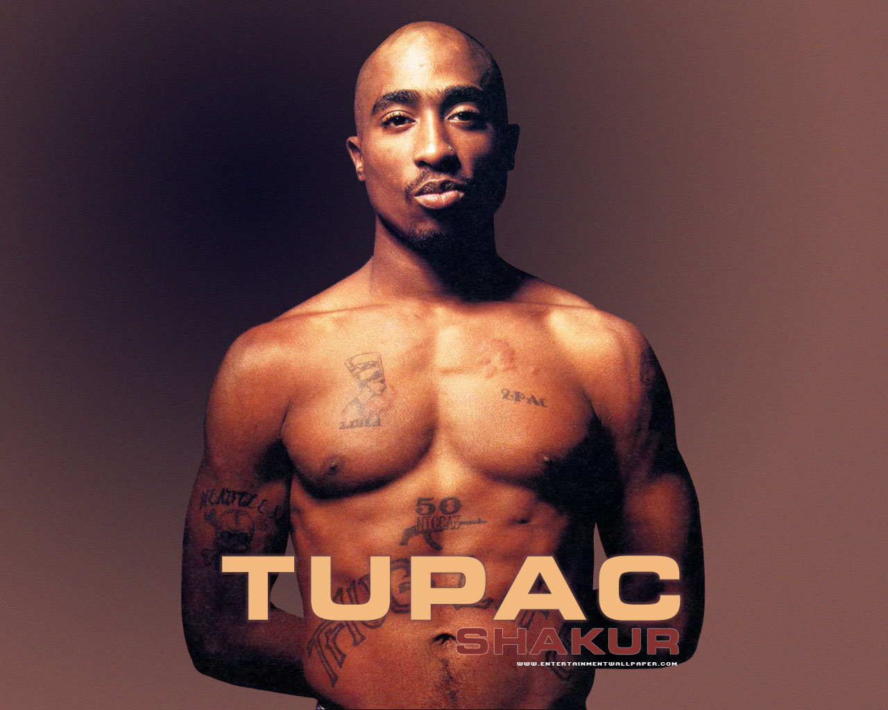

<!--# Thug Life-->

I slutningen af 1993 dannede han rapgruppen Thug Life med en række af sine venner, herunder Big Syke, Macadoshis, hans stedbror Mopreme Shakur, og Rated R. Gruppen udgav deres eneste album Thug Life: Volume 1 den 26. september 1994, som solgte guld. Albummet indeholdt singlen "Pour Out a Little Liquor" produceret af Johnny "J", der efterfølgende producerede en stor del af All Eyez on Me og mange andre af hans albummer senere.