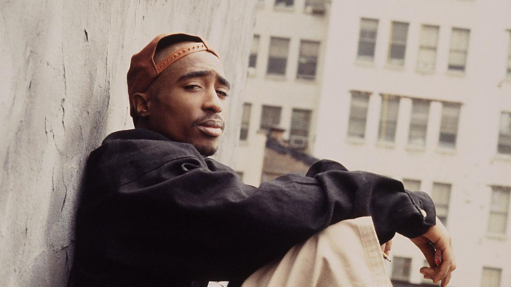

<!--# Tupac Amaru Shakur -->

(16. juni 1971 – 13. september 1996), bedre kendt under sine kunstnernavne 2Pac og kortvarigt som Makaveli, var en amerikansk rapper og skuespiller. Shakur har solgt over 75 millioner albummer på verdensplan, hvilket gør ham til en af de bedst sælgende musik-kunstnere gennem tiderne.[5] Han blev født i Harlem i New York City, men i 1986 flyttede hans familie til Baltimore, hvor han kom på Baltimore School for the Arts, for endelig i 1988 at bosætte sig i Californien. Begge hans forældre og flere andre i hans familie var medlemmer af De Sorte Pantere, hvis idealer er blevet afspejlet i hans sange.

Han begyndte sin karriere som roadie og danser for den alternative hiphop gruppe Digital Underground, og debuterede i 1991 med soloalbummet 2Pacalypse Now efterfulgt af Strictly 4 My N.I.G.G.A.Z. i 1993. Senere dannede han gruppen Thug Life, der udsendte deres album Thug Life: Volume 1 i 1994. På de tre albummer viste han et imponerende flow og et stort talent for at tage sociale emner op på en måde, der appellerede til et bredt publikum i tiden.

Han var også involveret i en række kriminalsager, der bl.a. omfattede skyderi og voldtægt. Nogle af episoderne blev anset for at være en del af et opgør mellem West Coast-rapscenen, repræsenteret af Shakur, og East Coast-rapperne The Notorious B.I.G. og Sean Combs. I november 1994 blev han således skudt ned på Manhattan, i hvad han selv anså for at være et bagholdsangreb iscenesat af de to førnævnte East Coast-rappere. Han overlevede episoden, men blev i 1995 idømt en fængselsstraf for et tidligere begået seksuelt overgreb. Mens han sad fængslet udgav han det anmelderroste album Me Against the World, der solgte 240.000 eksemplarer i udgivelsesugen, hvilket var en rekord for en solo rapper på daværende tidspunkt.

Efter han blev løsladt i oktober 1995 dannede han sammen med Yaki Kadafi rapgruppen Outlawz. Han havde også skrevet kontrakt med det berygtede, multi-million dollar pladeselskab, Death Row Records, og udgav i 1996 det anmelderroste dobbeltalbum, All Eyez on Me, der alene i USA har solgt 5,8 mio. eksemplarer. Senere samme år udgav han det mere mørktonede og dystre The Don Killuminati: The 7 Day Theory under hans alias Makaveli.

Sideløbende med karrieren som rapper spillede han også med i en række film, bl.a. John Singletons Poetic Justice (1993), hvor han spillede overfor Janet Jackson. Flere dokumentarfilm har desuden forsøgt at kulegrave diverse aspekter af hans dramatiske liv og død.

Den 7. september 1996 blev han skudt i et såkaldt drive-by shooting i krydset mellem Flamingo Road og Koval Lane i Las Vegas, Nevada. Han blev indlagt på hospitalet, hvor han døde seks dage senere, som følge af sine kvæstelser. Dødsfaldet medvirkede til hans øgede popularitet, og efterfølgende er der blevet udsendt flere albummer med tidligere optagede numre, senest Pac's Life fra 2006.